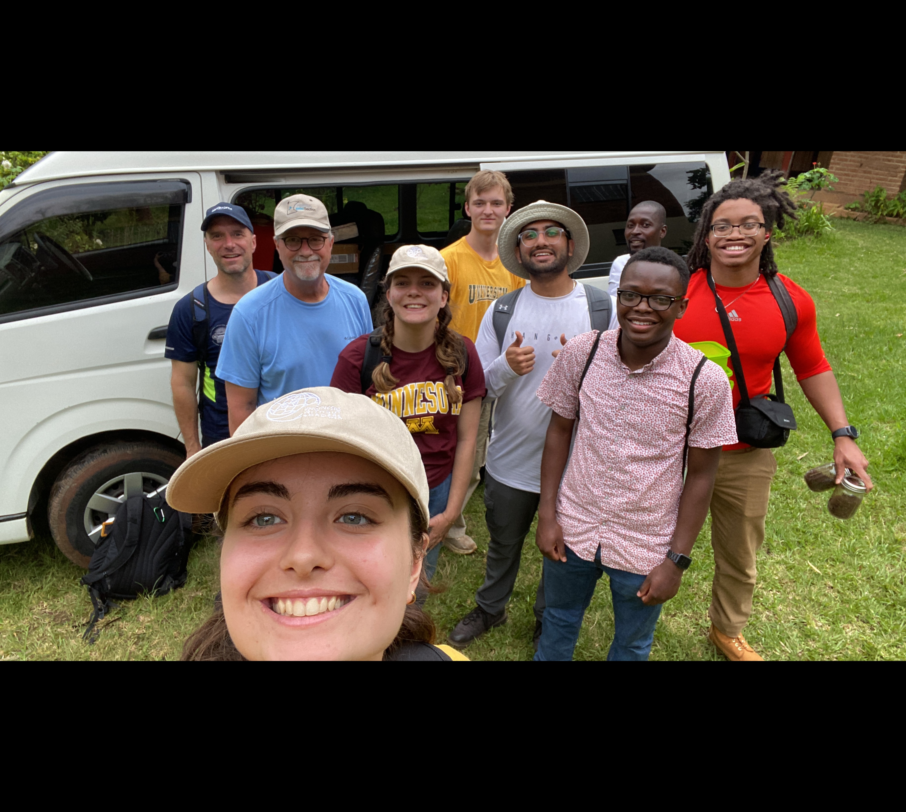

# Mihir Madhaparia {#about}

<section class="section" id="about">
## About Me 
I am a dedicated and innovative engineer with a passion for medical technology, bioprinting, and applied research. With a strong background in mechanical engineering, materials science, and biomedical device development, I strive to bridge the gap between technology and healthcare to improve patient outcomes. My work spans research, product development, and leadership in various engineering disciplines.

Born and raised in Kenya, I am a first-generation college student currently pursuing my academic and professional journey in the United States. My experiences have shaped my commitment to innovation and problem-solving, particularly in the medical device industry.
</section>

---

<section class="section" id="work">
## Work Experience {#work}
### SwiftZip LLC (2024 - Present)
- Stakeholder and contributor to the commercialization of an innovative medical device developed at the Bakken Medical Device Center.

### Hennepin County Medical Center
- Conducted clinical research focused on emergency medicine and patient care optimization.
- Assisted in the development of new protocols aimed at improving patient outcomes and workflow efficiencies.
</section>

---

<section class="section" id="education">
## Education {#education}
**University of Minnesota**
- Bachelor of Science in Mechanical Engineering (Expected Graduation: 2025)
- Relevant coursework: Biomaterials, Biomechanics, Finite Element Analysis, Robotics, and Computational Modeling
</section>

---

<section class="section" id="projects">
## Projects {#projects}
### Research Experience  

#### McAlpine Research Group, University of Minnesota (Jan 2024 - Present)
- Advanced regenerative medicine through pioneering 3D bioprinting techniques for neural, dorsal, ventral, and induced pluripotent stem cells, addressing tissue engineering gaps for paraplegia.
- Optimized large-scale printing of scaffolding structures using advanced 3D printing methods, improving efficiency and precision.
- Designed experiments to enhance scaffold performance, ensuring material compatibility with stem cells for optimal growth.
- Developed protocols to improve reproducibility in stem cell printing and extrusion.

#### Earl Bakken Medical Device Center, University of Minnesota (Mar 2022 - Present)
- Collaborated on developing and testing a novel medical device addressing industry-identified surgical challenges.
- Conducted tensile testing on 3D-printed materials and developed in vivo simulation test methods.
- Researched custom polymer compositions to enhance injection molding performance and dimensional tolerancing.
- Contributed to the authorship of Consumer & Product Requirement Documentation for market realization.
</section>

---

<section class="section" id="gallery">
## Gallery {#gallery}
### Engineers Without Borders - UMN (Malawi Project)  

<iframe src="https://drive.google.com/file/d/1RnbMXfTiYPPIkiVAcxxdpy5RfMIcrQ28/preview" 
        width="640" height="360" allow="autoplay"></iframe>

*This prototype utilizes thermal and massaging mechanisms to improve vein dilation for peripheral intravenous (PIV) access, particularly in pediatric and small-vein cases.*

### Bioprinting Scaffold Research  

*Demonstration of bioprinting scaffolds optimized for neural and tissue regeneration.*
</section>

---

<section class="section" id="contact">
## Contact {#contact}
- **Email:** mihirmadhaparia@gmail.com  
- **LinkedIn:** [linkedin.com/in/mihirmadhaparia](https://www.linkedin.com/in/mihirmadhaparia/)  
- **GitHub:** [github.com/mihir-madhaparia](https://github.com/mihirmadhaparia)  
</section>
