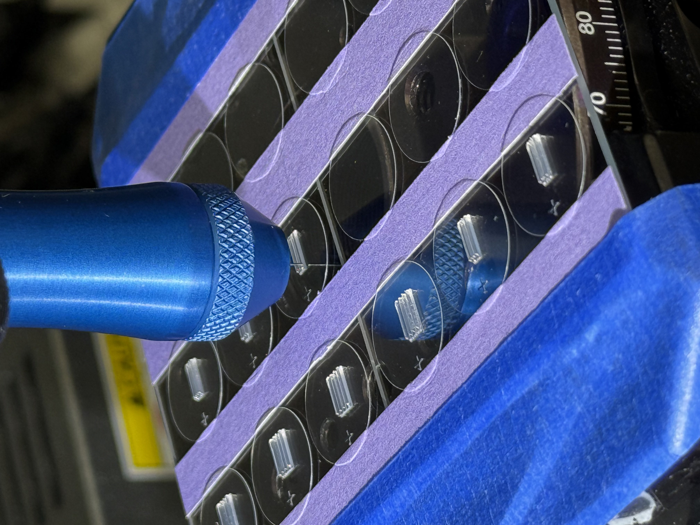

# Mihir Madhaparia {#about}

## About Me
I am a **dedicated and innovative engineer** with a passion for **medical technology, bioprinting, and applied research**. My expertise lies at the intersection of **mechanical engineering, materials science, and biomedical device development**, where I strive to bridge the gap between **technology and healthcare** to enhance patient outcomes. 

Born and raised in Kenya, I am a **first-generation college student** currently advancing my academic and professional journey in the United States. My experiences have shaped a deep commitment to **innovation, problem-solving, and leadership**, particularly in the **medical device industry**. I have spearheaded **cutting-edge research in regenerative medicine**, developed **novel medical devices**, and led **global engineering initiatives** to improve sanitation and healthcare access.

---

## Work Experience {#work}

### **SwiftZip LLC (2025 - Present)**
As a **Co-Founder & Stakeholder** at SwiftZip LLC, I lead **research and development efforts** for a revolutionary **surgical suture alternative**. I played a pivotal role in **conceptualizing, prototyping, and refining** this device, ensuring it aligns with **regulatory standards and market demands**. Working closely with **medical physicians and neurosurgeons**, I established rigorous **quality control processes** to guarantee safety and efficacy. Additionally, I authored the **Consumer & Product Requirement Documentation (CPRD)**, outlining critical performance criteria to drive market success.

### **Hennepin County Medical Center (2024)**
During my tenure as a **Research & Quality Intern**, I **streamlined patient consent workflows**, enhancing **ethical compliance** and improving documentation efficiency. My work in **clinical research studies** helped identify **gaps in drug effectiveness**, providing **personalized insights** into treatment outcomes. I also spearheaded an initiative to **redesign consent protocols**, leveraging **psychological principles** to enhance patient understanding and participation in clinical trials.

### **Abbott Laboratories – Structural Heart (2023)**
As a **Research & Development Engineer Co-op**, I worked on **next-generation medical devices**, optimizing manufacturing processes to **reduce production costs and improve efficiency**. I led a team of interns and technicians, implementing **structured methodologies** that accelerated product development by **45%**. By identifying design inefficiencies and **re-engineering components**, I reduced operator time on the **production line by 18%**. Additionally, I conducted **competitor analyses**, providing key insights that enhanced **marketing strategies and buyer engagement**.

### **Earl Bakken Medical Device Center (2022 - Present)**
At the **Earl Bakken Medical Device Center**, I contributed to the development of **a novel suturing device**, collaborating with **industry experts and regulatory professionals** to refine its design. My role encompassed **mechanical testing, in vivo simulations, and material optimization** for **enhanced injection molding performance**. I also played a significant role in securing **funding applications and capital table discussions** for future product development.

---

## Education {#education}

### **University of Minnesota – Twin Cities**  
- **Master of Science in Mechanical Engineering** (Expected **December 2025**)  
- **Bachelor of Mechanical Engineering, Minor in Computer Science** (January 2021 - December 2024)  
- **Relevant coursework:** Biomaterials, Biomechanics, Finite Element Analysis, Robotics, Computational Modeling

---

## Projects {#projects}

### **McAlpine Research Group (2024 - Present)**
As a **Research Assistant**, I am pioneering **3D bioprinting techniques** for **neural, dorsal, ventral, and induced pluripotent stem cells**. My work focuses on creating **artificial spinal cord segments** to address critical gaps in **tissue engineering for paraplegia**. By leveraging **machine learning algorithms**, I optimized **large-scale scaffold printing**, increasing efficiency by **62%**. Additionally, I developed **standardized protocols** to improve **stem cell reproducibility and extrusion reliability**.

### **Engineers Without Borders – University of Minnesota (2022 - Present)**
As the **President** of Engineers Without Borders (**2024 - Present**), I oversee **project planning, execution, and fundraising** for **three major engineering initiatives**. Working with **Rotary Clubs and international NGOs**, I secured over **$340,000 in funding** for water and sanitation projects in **East Africa**. Previously, as **Project Lead for the East Africa Project (2022 - 2024)**, I led efforts to implement **sustainable water access solutions** for rural communities, drafting contractual agreements with local partners and managing international collaborations.

---

## Gallery {#gallery}

### **Engineers Without Borders - UMN (Malawi Project)**  

<iframe src="https://drive.google.com/file/d/1RnbMXfTiYPPIkiVAcxxdpy5RfMIcrQ28/preview" 
        width="640" height="360" allow="autoplay"></iframe>

*Fieldwork in Malawi implementing community-driven water sanitation solutions.*

### **Bioprinting Scaffold Research**  

*Demonstration of bioprinting scaffolds optimized for **neural regeneration**.*

---

## Contact {#contact}
- **Email:** mihirmadhaparia@gmail.com  
- **LinkedIn:** [linkedin.com/in/mihirmadhaparia](https://www.linkedin.com/in/mihirmadhaparia/)  
- **GitHub:** [github.com/mihir-madhaparia](https://github.com/mihirmadhaparia)
